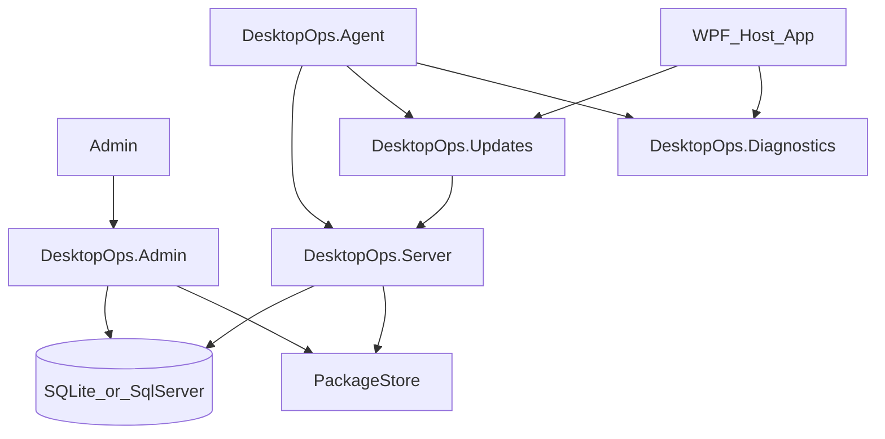

# Architecture

DesktopOps is a self-hosted deployment stack with three runtime roles.

## Domain model

- `ManagedProgram` – distributable desktop program (`Slug`, optional `ShortName`)
- `UserGroup` / `UserGroupMember` – usernames (optional Windows SID) that receive programs
- `ProgramAssignment` – links a program to a group
- `ReleasePackage` – versioned ZIP with `PackageHash` (SHA-256) and publish timestamp
- `ClientRegistration` – agent (`ProgramSlug = _agent_`) or embedded app client
- `DeploymentEvent` – status callbacks (`Available`, `Downloading`, `Installed`, `Failed`, `Removed`)

Assignment path: **User → Group → Program → published Release**.

## Package flow

1. Admin uploads a ZIP through Admin or `POST /api/releases`.
2. Server stores the file under `Storage:RootPath` and records SHA-256 + size.
3. Admin publishes the release.
4. Agent loads assignments via `GET /api/clients/{id}/assignments`.
5. Client downloads `GET /api/packages/{releaseId}`, verifies hash, installs into the local programs directory, writes a `.dops` manifest, and reports events.

## Client install layout

Default install root:

`%LocalAppData%\DesktopOps\Programs`

Per program:

- `{slug}.dops` – JSON manifest (version, file list, package hash)
- `{slug}-{version}-backup.zip` – last backup before an update

## Database providers

`Database:Provider` = `Sqlite` (default) or `SqlServer`.
Connection string key: `ConnectionStrings:DesktopOps`.

## Admin security

`DesktopOps.Admin` optionally uses Windows Negotiate authentication with two AD roles (configured under `Security`):

- **Manager** (`ADGroup` or `DeveloperADGroup`) – groups, assignments, rollouts, dashboard
- **Developer** (`DeveloperADGroup`) – programs and release publish

Set `Security:Enabled` to `true` and fill both group names for production. With `Enabled: false`, authorization policies succeed for local demos. Client-facing `DesktopOps.Server` APIs are not Windows-gated.

## Decoupling principles

- No private NuGet feeds
- No Kluehspies / Telerik / CoreUI dependencies
- Serilog on the server for request logging
- Tray UI via Hardcodet.NotifyIcon.Wpf + CommunityToolkit.Mvvm patterns in the agent
